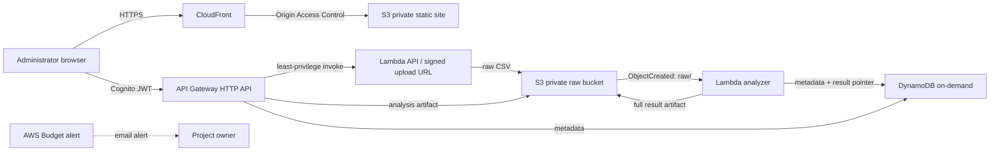

# IEAI-ALP — Intelligent ERP Access Intelligence & Adaptive Least Privilege

An evidence-backed access-governance research application for role mining, user profiling, risk analysis, policy optimization, and safety-constrained offline reinforcement learning. The dashboard never invents access records or seeds example results. It displays computed results only after a dataset is imported.

> **Research scope:** Public access-control benchmarks are not university ERP datasets. Results show what the algorithms do on the named benchmark. LANL authentication data is a separate behavioral telemetry experiment, not a permission matrix. This repository does not claim live ERP integration, automated enforcement, formal proof, or measured outcomes before a real run.

## AWS and cloud architecture



The deployable AWS mode uses **Amazon S3, AWS Lambda, API Gateway HTTP API, Amazon Cognito, DynamoDB, CloudFront, IAM, and AWS Budgets**. The browser requests an upload URL from the Cognito-protected API, uploads the CSV to private S3, and the S3 event invokes the analysis Lambda. Analysis results are written to S3 (to avoid DynamoDB's 400 KB item limit); DynamoDB stores searchable run metadata and the artifact pointer. The browser reads results through the authenticated API.

AWS IAM Access Analyzer is an optional, separately run validation step for the stack's IAM policies. It can report policy findings; the project does not call it a Zelkova proof of the mined dataset permissions. Do not attach generated dataset labels as AWS IAM permissions. They are not valid AWS action/resource names.

The local mode is fully usable without AWS: FastAPI, SQLite, and static files run on the student's computer. The cloud stack is an educational deployment profile, not required to inspect or analyze datasets.

### Cost and security notes

- The template avoids EC2, RDS, Neptune, NAT gateways, and always-on compute. Lambda and API Gateway are request-driven; DynamoDB uses on-demand billing; S3 uploads expire after 30 days. CloudFront and Cognito complete the professional cloud architecture.
- **No design can promise $0 for all accounts and traffic.** AWS plan-specific allowances change: check the [current AWS Free Tier terms](https://docs.aws.amazon.com/awsaccountbilling/latest/aboutv2/free-tier.html) and [service pricing pages](https://aws.amazon.com/pricing/) for the account/region before deploy. Requests, storage, data transfer, account age, and free-plan eligibility affect charges. A Budget is an alert, **not** a spending cap or kill switch. Do not upgrade from an AWS Free account plan if the account must remain within its no-charge period.
- CloudFront may take time to deploy. The stack creates S3, CloudFront, Cognito, Lambda, API Gateway, DynamoDB, and a Budget resource. Remove the stack after the course demo and remove retained S3 data if appropriate.
- CloudFront serves the static app over HTTPS from a private S3 origin. The API requires a Cognito JWT. The browser token is held in `sessionStorage`; use a dedicated administrator account and sign out/close the session after a demo. Restrict `AllowedOrigin` to the CloudFront domain after first deployment. The default `*` eases initial setup but is not an access control; Cognito remains required.
- The first administrator account is created manually with Cognito `AdminCreateUser`; public sign-up is disabled. The generated temporary password must be changed at first sign-in. The basic browser flow does not implement Cognito's `NEW_PASSWORD_REQUIRED` challenge yet; set a permanent password for the demo user from the Cognito console/CLI before sign-in.
- AWS Budgets notifications are sent to the deployment email. Configure email verification as prompted. Budgets do not stop resources.

## Data: real, public, traceable

**Primary role mining:** [Stony Brook / LPOP role-mining data paper](https://www3.cs.stonybrook.edu/~liu/papers/RoleMiningData-LPOP20.pdf) documents the widely used real-world ACL collection and benchmark sizes; it links the data at <http://lpop.cs.stonybrook.edu/rbac-challenge>. For a scalable run, `americas-large` has 3,485 users, 10,127 permissions, and 185,294 assignments. These data are network access control lists, healthcare permission sets, Lotus Domino profiles, and an HP customer access graph—not ERP histories or employee HR profiles. Follow the source's usage terms. This project does not bundle third-party raw data.

**Optional prediction baseline:** [Amazon Employee Access Challenge](https://www.kaggle.com/c/amazon-employee-access-challenge/data) is subject to Kaggle competition rules and may require account access. It is a historical access approval/prediction task. It should not be described as continuous ERP telemetry or as RL feedback.

**Separate temporal behavior experiment:** [LANL Cyber Security Research datasets](https://lanl.ma.ic.ac.uk/data/) include anonymized authentication events. These events do not encode ERP permissions. They are intentionally not merged with the role-mining UPA. A chunked LANL adapter is a future extension; the current importer accepts permission matrices only.

Data provenance in each run records the imported file SHA-256, upload time, supplied dataset/source name and license note, measured cardinalities, and run ID. The included Firewall1 manifest adds raw and derived hashes and matrix validation. Other user-provided source URLs/license notes are not independently verified.

### Convert an ACL edge list to the app CSV

The backend accepts a CSV with `user_id,permission_id`, one grant per row. Each pair is an observed authorization edge. There is no bundled sample dataset. A source with separate user and permission tables must be converted from its actual ACL relation; do not synthesize grants or add made-up departments.

```csv
user_id,permission_id
source-user-001,source-permission-17
source-user-001,source-permission-21
source-user-002,source-permission-17
```

Use source-native opaque IDs where possible. Blank IDs are rejected. Exact duplicate user-permission edges are deduplicated for the matrix; the run's assignment count is the number of distinct edges.

## Analysis methods and honest limits

| Feature | Implemented computation | Limit |
|---|---|---|
| Access ingestion | CSV ACL edge list, validation, hashing, SQLite (local) or private S3 (AWS) | No CloudTrail capture of ERP APIs; no HR attributes fabricated |
| User profiling | Grant count, dataset-relative density, rare-grant count, access-set cohort | ACL-only profile; no temporal features unless a temporal source adapter is added |
| Role discovery | Lossless equivalence classes for identical observed permission sets | Interpretable cohorting, not semantic departments; no guarantee of globally minimum WSC |
| Risk analysis | Rare grant prevalence (≤5% of users) and relative permission density | Statistical review cue, not exploitability, business impact, or confirmed anomaly |
| Optimization | Compare direct-ACL baseline with exact-cover access-set roles; report WSC and coverage | WSC can rise on some matrices; exact grouping minimizes role count for this representation, not total WSC |
| Recommendations and dynamic management | Local admin can retain or approve removal of an observed rare grant from the app's active policy snapshot; each effective change creates a version and audit event | The source matrix remains immutable. This changes only this app's benchmark policy view; it does not provision/deprovision a real ERP user or AWS IAM principal |
| Reinforcement learning | Reproducible tabular Q-learning over observed rare-grant state buckets with explicitly counterfactual rewards | Not trained on actual approval feedback, not production validated, and does not mutate permissions |
| IAM policy output | Local export illustrates translation boundaries | Dataset permission labels are not AWS actions/resources; output is not deployable policy |

The WSC implementation is `|R| + |UA| + |PA|`, with unit weights and no role hierarchy/direct user grants. The baseline uses one role per user (`|R|=|U|`, `|UA|=|U|`, `|PA|=|UPA|`); the candidate uses identical permission-set cohorts. It measures representation size for that baseline and candidate model. Do not reuse claimed Phase-I targets (42%, 68%, 100% wildcard removal, throughput) as results; calculate and report actual run outputs. Local endpoints `POST /api/decisions` and `GET /api/policy-versions` record human review, apply approved removals to the active policy view, allow restoration, and preserve an audit trail. Every chart and metric is recomputed from that versioned effective grant set.

## Run locally

Requires Python 3.11+.

```powershell
py -m venv .venv
.\.venv\Scripts\Activate.ps1
pip install -r requirements.txt
uvicorn app.main:app --reload
```

Open <http://127.0.0.1:8000>. Import the source CSV in the interface. API schema is at <http://127.0.0.1:8000/docs>. The SQLite database lives at `data/ieai.sqlite3`; keep raw third-party data under `data/raw/` only if its terms permit local copies. No results are created until valid input is provided.

## Deploy the AWS stack

Requirements: AWS CLI configured for the intended account/region, AWS SAM CLI, and a verified notification email. Start in an account plan that matches your no-cost constraint. The AWS deployment is an explicit action that creates real resources and may incur charges outside applicable allowances.

```powershell
sam build --template-file infra/template.yaml
sam deploy --template-file .aws-sam/build/template.yaml --guided
```

During guided deploy choose a unique `AppName`, supply your alert email, and review the CloudFormation change set. The first deployment outputs API URL, raw bucket, frontend bucket, Cognito user-pool IDs and CloudFront URL. Create an admin-only Cognito user and set its permanent password before using the console:

```powershell
aws cognito-idp admin-create-user --user-pool-id USER_POOL_ID --username ADMIN_EMAIL --user-attributes Name=email,Value=ADMIN_EMAIL --temporary-password 'Use-A-Unique-Temporary-Pass9!'
aws cognito-idp admin-set-user-password --user-pool-id USER_POOL_ID --username ADMIN_EMAIL --password 'Use-A-Different-Permanent-Pass9!' --permanent
```

Before uploading the static app, create `app/static/config.js` using the stack outputs:

```javascript
window.IEAI_CONFIG = {
  apiUrl: "https://API_ID.execute-api.REGION.amazonaws.com",
  region: "REGION",
  clientId: "COGNITO_APP_CLIENT_ID"
};
```

Set the stack `AllowedOrigin` to the CloudFront HTTPS origin in a follow-up deployment, then upload the frontend assets to the frontend bucket (`config.js` is deployment-specific and must not contain secrets):

```powershell
aws s3 sync app/static s3://FRONTEND_BUCKET --delete
```

The API endpoints are JWT protected: `POST /datasets/presign`, `GET /datasets`, `GET /analytics/{dataset_id}`, and `POST /security/validate`. The Access Analyzer route accepts `{"policy_document": { ...IAM identity policy... }}` and returns AWS policy validation findings. This checks IAM policy syntax and best-practice findings; it is not an access proof and does not validate the research UPA. Upload the CSV to the returned presigned URL with `Content-Type: text/csv`; the S3 event runs analysis. The `raw/` prefix triggers Lambda; derived artifacts use `results/` and do not retrigger it. The first page load requires an authenticated administrator session.

To remove the stack after your demo:

```powershell
aws s3 rm s3://RAW_BUCKET --recursive
aws s3 rm s3://FRONTEND_BUCKET --recursive
sam delete --stack-name STACK_NAME
```

Review the CloudFormation stack resources first. Never run cleanup against a bucket that contains anything outside this project.

## Portfolio and research claims

Suggested CV entry after running the system on the actual benchmark and inserting measured results:

> Built IEAI-ALP, a serverless access-intelligence platform using Python, FastAPI, S3, Lambda, API Gateway, Cognito, DynamoDB, CloudFront, and IAM. Implemented reproducible ACL ingestion, role discovery, WSC/coverage analysis, risk-ranked permission review, and an auditable offline Q-learning experiment on [dataset and measured scale]; all recommendations require human approval.

Do not claim patentability or novelty from implementation alone. Keep dated design notes and literature comparisons; consult your university IP office before public disclosure or filing. A patent claim needs a specific, non-obvious technical contribution and legal review.

## Project structure

```text
app/main.py            Local FastAPI, SQLite persistence and analytics API
app/cloud_handler.py   Cognito-authorized API + S3 event adapter for AWS
app/static/            Responsive frontend, no bundled/demo data
infra/template.yaml    SAM/CloudFormation serverless infrastructure
data/raw/              Local raw data area (empty; do not commit licensed data)
data/processed/        Local derived data area
```
